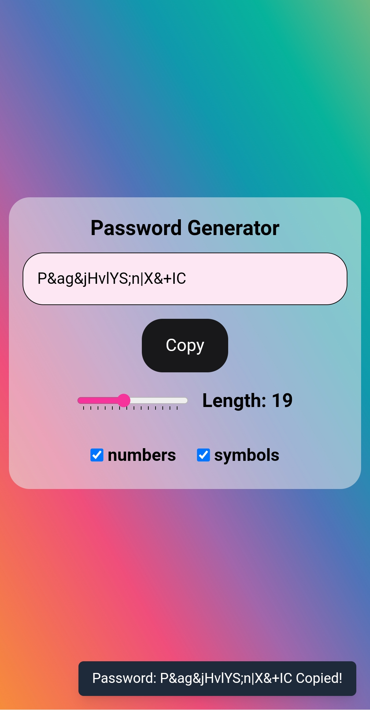

# Password Generator React App

A secure and responsive password generator with customizable complexity options, built with React and Tailwind CSS.

## Features
- 🔒 Generate strong passwords up to 64 characters
- 📱 Mobile-first responsive design
- 🛠 Customizable character sets (uppercase, lowercase, numbers, symbols)
- 📏 Length slider with visual feedback
- 📋 One-click copy to clipboard with auto-clear
- 🎨 Modern UI with accessibility features
- 🔄 Recent UI improvements including:
  - Enhanced mobile responsiveness
  - Unified button styling
  - Improved form element spacing

## Tech Stack
- React 18
- Tailwind CSS 3
- Vite 4
- Heroicons

## Usage
1. Adjust length slider (8-64 characters)
2. Select character types
3. Click "Generate Password"
4. Use copy button (auto-clears clipboard after 30s)

## Screenshots
| Desktop View | Mobile View |
|--------------|-------------|
|  |  |

## Getting Started
1. Clone the repo: `git clone https://github.com/ms0031/ReactApps.git`
2. Navigate to a project folder (e.g., `cd passwordGenerator`)
3. Install dependencies: `npm install`
4. Run locally: `npm run dev`

## License
MIT Licensed. See [LICENSE](LICENSE) for details.

## Contributing
This is a personal learning project, but feel free to fork and experiment!