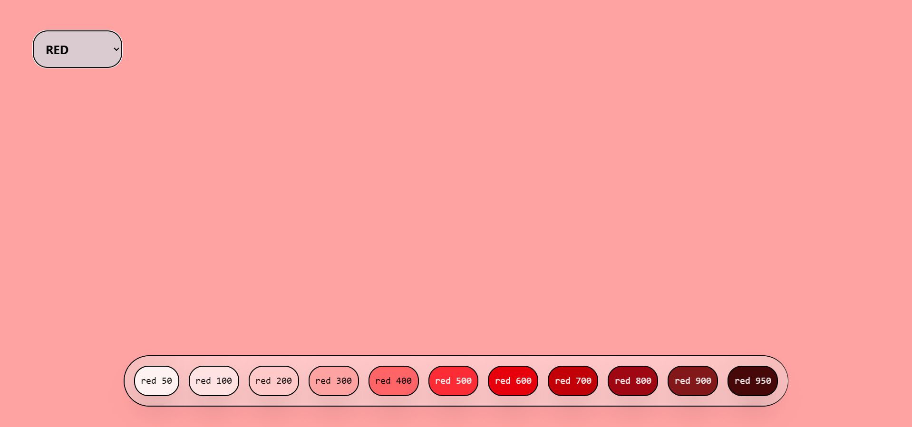

# [Tailwind CSS Colors Explorer](https://colors-1wy.pages.dev/)

A simple React application that allows you to explore and visualize Tailwind CSS color palettes. This tool helps developers pick the right color shade for their Tailwind CSS projects.

## Features

- Browse through all Tailwind CSS color palettes
- View different shades (50-950) for each color
- Interactive UI with real-time color preview
- Easy-to-use dropdown for color selection

## Technologies Used

- React.js
- Tailwind CSS
- Vite (for build tooling)

## Demo
- Link - [Tailwind CSS Colors Explorer](https://colors-1wy.pages.dev/)

## Screenshots
| Desktop View |
|--------------|

## BUGS & Limitations
- Responsive Design Issues :
  - ~~Color buttons overflow on small screens~~ **(fixed)**
  - ~~Dropdown menu not optimized for mobile view~~ **(fixed)**
  - ~~Layout breaks on screens smaller than 640px~~ **(fixed)**
- Future enhancements planned to address these issues

## Getting Started
1. Clone the repo: `git clone https://github.com/ms0031/ReactApps.git`
2. Navigate to a project folder (e.g., `cd tailwindcss-colors`)
3. Install dependencies: `npm install`
4. Run locally: `npm run dev`

## Usage
1. Select a color from the dropdown menu
2. Click on different shade buttons to see various intensities
3. The background will update to display the selected color and shade

## Project Structure
- src/App.jsx - Main application component
- src/components/Button.jsx - Color shade selection buttons
- src/components/Options.jsx - Color dropdown selector

## Acknowledgements
- Tailwind CSS for the color system
- React for the UI framework