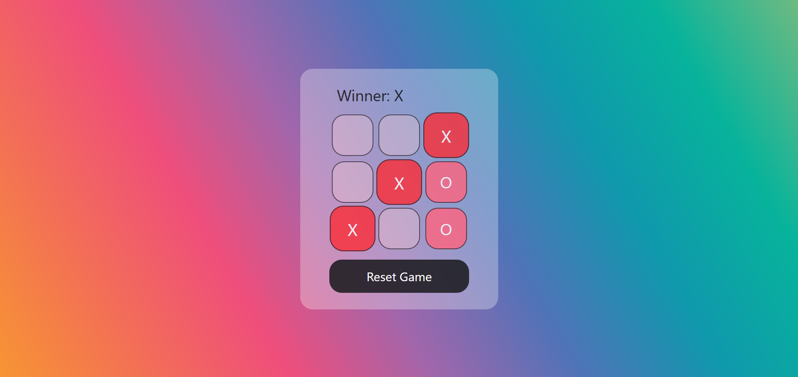
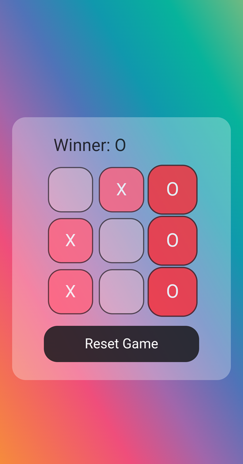

# Tic-Tac-Toe Game

A modern, interactive Tic-Tac-Toe game built with React and Vite, featuring a sleek UI with animations and special effects.

## Features

- 🎮 Classic Tic-Tac-Toe gameplay
- 🎨 Modern UI with Tailwind CSS
- ✨ Interactive animations and transitions
- 🎉 Celebration effects when a player wins
- 🔄 Game state management with React hooks
- 🎯 Highlighting of winning combinations
- 🔄 Easy game reset functionality
- 📱 Responsive design for all devices

## Technologies Used

- React.js
- Vite
- Tailwind CSS
- React Confetti (for winner celebrations)


## Screenshots
| Desktop View | Mobile View |
|--------------|-------------|
|  |  |


## Getting Started
1. Clone the repo: `git clone https://github.com/ms0031/ReactApps.git`
2. Navigate to a project folder (e.g., `cd tic-tac-toe`)
3. Install dependencies: `npm install`
4. Run locally: `npm run dev`

## How to Play
1. The game is played on a 3×3 grid
2. Players take turns placing X or O in empty squares
3. The first player to get 3 of their marks in a row (horizontally, vertically, or diagonally) wins
4. If all squares are filled and no player has 3 marks in a row, the game is a draw
5. Use the "Reset Game" button to start a new game

## Project Structure
```plaintext
tic-tac-toe/
├── src/
│   ├── components/
│   │   ├── Board.jsx       # Game board logic and rendering
│   │   └── Square.jsx      # Individual square component
│   ├── App.jsx             # Main game component
│   ├── App.css             # Global styles
│   └── main.jsx            # Entry point
├── public/                 # Static assets
└── package.json            # Project dependencies
```

## Game Logic
The game implements the following logic:

- Tracks the state of each square (X, O, or null)
- Determines the winner by checking all possible winning combinations
- Prevents further moves after a win or draw
- Highlights the winning combination
- Shows a celebration animation when a player wins

## Contributing
Contributions are welcome! Please feel free to submit a Pull Request.

## License
This project is licensed under the MIT License - see the LICENSE file for details.